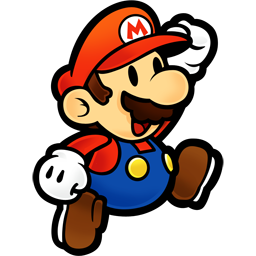
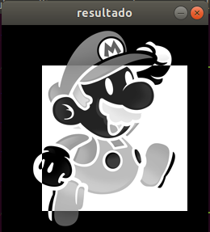
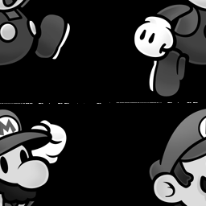
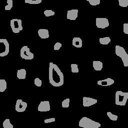
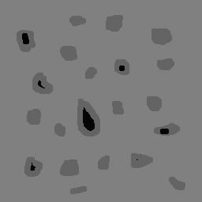
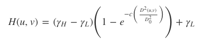
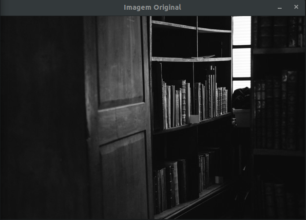
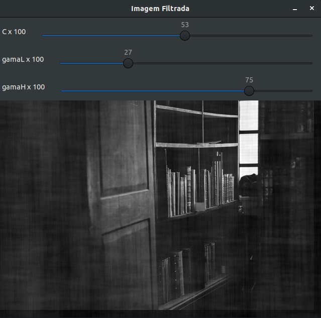

= Processamento Digital de Imagens
Isaías Lucena <isaiiaslucena@gmail.com>

Saudações! Sou Isaías, graduando do curso de Engenharia Mecatrônica pela UFRN.

:toc:
:icons: font
:quick-uri: https://asciidoctor.org/docs/asciidoc-syntax-quick-reference/

[.text-justify]
Essa página tem como objetivo postar a resolução dos exercícios propostos da disciplina de Processamento Digital de Imagens, ministrada pelo professor Agostinho Brito Júnior. +
Os códigos são desenvolvidos em C++ utilizando a biblioteca do OpenCV.

== Exercícios

== 1. Negativo de uma imagem

[.text-justify]
O primeiro exercício consiste em exibir o negativo de uma imagem, dado as coordenadas de dois pontos P1 e P2, localizados
dentro dos limites do tamanho da imagem. A região definida pelo retângulo de vértices opostos definidos pelos pontos P1 e P2 será exibida com o negativo da imagem na região correspondente.

Abaixo está a imagem utilizada e o código de execução.

.Mario

[source,cpp]
----
#include <iostream>
#include <opencv2/opencv.hpp>
using namespace cv;
using namespace std;

int main (int, char**) {

  Mat image;

  int x1=0, x2=0, y1=0, y2=0;

    image= imread("mario.png",CV_LOAD_IMAGE_GRAYSCALE);
    if(!image.data)
        cout << "nao abriu biel.png" << endl;

    namedWindow("resultado",WINDOW_AUTOSIZE);

    do {
      cout << "Digite o valor da coordenada x1" << endl;
      cin >> x1;
      cout << "Digite o valor da coordenada x2" << endl;
      cin >> x2;
      cout << "Digite o valor da coordenada y1" << endl;
      cin >> y1;
      cout << "Digite o valor da coordenada y2" << endl;
      cin >> y2;
    } while (x1 > 256 || x1 < 0 || x2 > 256 || x2 < 0 || y1 > 256 || y1 < 0);

    for(int i=x1;i<x2;i++){
        for(int j=y1;j<y2;j++){
         image.at<uchar>(i,j)=255-image.at<uchar>(i,j);
        }
    }
  
  imshow("resultado", image);  
  waitKey();
    return 0;
}
----

.Saída do exercício

== 2. Troca de regiões

[.text-justify]
Este exercício consiste na troca dos quadrantes em diagonal em uma imagem.
Para realizar esta tarefa, primeiro foi feita uma cópia da imagem original, assim sendo possível realizar as modificações necessárias.

A varíavel rows armazena o número de linhas, e a varíavel columns o número de colunas.

Abaixo o código e a saída do programa trocaregioes.

[source,cpp]
----
#include <iostream>
#include <opencv2/opencv.hpp>

using namespace cv;
using namespace std;

int main (int, char**){

    Mat image;

    int columns, rows;

    image= imread("mario.png",CV_LOAD_IMAGE_GRAYSCALE); //lê uma imagem presente em um arquivo, e armazena no objeto image
    if(!image.data)
    cout << "nao abriu mario.png" << endl;

    namedWindow("resultado",WINDOW_AUTOSIZE);

    rows=image.size().height; //armazena o número de linhas da imagem na variável rows
    columns=image.size().width; //armazena o número de colunas da imagem na variável columns

    Mat clone;
    image.copyTo(clone);

    for(int i=0;i<rows/2;i++){
        for(int j=0;j<columns/2;j++){
        clone.at<uchar>(i,j)=image.at<uchar>(i+rows/2,j+columns/2);
        }
    }

    for(int i=128;i<rows;i++){
        for(int j=128;j<columns;j++){
        clone.at<uchar>(i,j)=image.at<uchar>(i-rows/2,j-columns/2);
        }
    }

    for(int i=128;i<rows;i++){
        for(int j=0;j<columns/2;j++){
        clone.at<uchar>(i,j)=image.at<uchar>(i-rows/2,j-columns/2);
        }
    }
    
    for(int i=0;i<columns/2;i++){
        for(int j=128;j<rows;j++){
        clone.at<uchar>(i,j)=image.at<uchar>(i+rows/2,j+columns/2);
        }
    }    
    
    imshow("resultado", clone);  
    waitKey();

    return 0;
}
----

.Troca de regiões

== 3. Rotulação

[.text-justify]
A rotulação de regiões é o processo pelo qual regiões com características comuns recebem um identificador comum (rótulo).

[.text-justify]
Em geral, um algoritmo de rotulação de imagens binárias recebe como entrada uma imagem binária e fornece como saída uma imagem em tons de cinza, com as várias regiões representativas de objetos rotuladas com um tom de cinza diferente.

O exercício pede uma solução para o caso em que existam mais de 255 objetos na cena, onde a rotulação ficaria comprometida.

A solução foi simples, definimos um valor fixo para o floodFill em 150.

[source,cpp]
----
  nobjects=0;
  for(int i=0; i<height; i++){
    for(int j=0; j<width; j++){
      if(image.at<uchar>(i,j) == 255){
		// achou um objeto
		nobjects++;
		p.x=j;
		p.y=i;
		floodFill(image,p,150); //Definimos um valor fixo para o floodfill em 150.
	    }
	  }
  }
----

.Rotulação

nobjects = 32

== 4. Contando bolhas

[.text-justify]
Agora queremos contar quantos objetos com ou sem buracos há na cena, e também devemos ignorar as bolhas que tocam na borda da imagem, pois não se pode presumir, a priori, que elas têm buracos ou não.

[.text-justify]
Implementando a retirada das bolhas que tocam as bordas da imagem, o algoritmo busca toda a imagem na primeira e última linhas e colunas da imagem, ao encontrar um pixel com valor 255 (sinalizando uma bolha), a função floodFill pinta essas bolhas com o tom de fundo da imagem (preto), assim elas desaparecem.

[source,cpp]
----
for(int i=0; i<altura; i++){
  for(int j=0; j<largura; j++){
    if(i==altura-1 || j==largura-1 || i==0 || j==0){
      if(mask.at<uchar>(i,j) == 255){
        p.x=j;
        p.y=i;
        floodFill(mask,p,0);
      }
    }
  }
}
----

.Removendo bolhas das bordas
image::bolhas_sem_bordas.png[]

[.text-justify]
O próximo passo seria contar bolhas na imagem sem as que tocavam nas bordas. Para isso, utilizando a função floodFill com outro tom de cinza para o fundo da imagem, os buracos continuam com valor 0, assim, sendo possível procurar pixels com valor 0 e rotular a região para a contagem.

[source,cpp]
----

// busca objetos com buracos presentes
nobjects=0;

for(int i=0; i<altura; i++){
  for(int j=0; j<largura; j++){
    if(mask.at<uchar>(i,j) == 255){
		// achou um objeto
		nobjects++;
		p.x=j;
		p.y=i;
		floodFill(mask,p,100); // 0 é o valor de fundo (preto), 255 para as bolhas não contadas e 100 para as bolhas contadas.
    }
	}
}

int nholes=0, nbubblesHoles=0;

p.x=0;
p.y=0;
floodFill(mask,p,128);

for(int i=0; i<altura; i++) {
  for(int j=0; j<largura; j++) {
    if(mask.at<uchar>(i,j) == 0) { // caso seja encontrado um pixel 0, significa que é um buraco.
    nholes++;
    nbubblesHoles++;
    p.x=j;
    p.y=i;
    floodFill(mask,p,nholes); // rotulando os buracos
    }
  }
}

cout << "Numero de bolhas: " << nobjects << endl;
cout << "Numero de bolhas com buracos: " << nholes << endl;
cout << "Numero de bolhas sem buracos: " << nobjects-nholes << endl;
imshow("image", mask);

imwrite("contabolhas.png", mask);

waitKey();

return 0;
}

----

.Saída final do programa

Numero de bolhas: 21

Numero de bolhas com buracos: 7

Numero de bolhas sem buracos: 14

== 4. Laplaciano do Gaussiano

[.text-justify]
Utilizando o programa filtroespacial.cpp como base, foi implementado uma nova funcionalidade onde é calculada o laplaciano do gaussiano das imagens capturadas ao pressionar a tecla "f".

[.text-justify]
Ao compararmos os filtros laplaciano e laplaciano do gaussiano, podemos concluir que o segundo filtro tem um desempenho melhor e deixa mais nítida as bordas da imagem.

Segue abaixo código implementado.

[source,cpp]
----
#include <iostream>
#include <opencv2/opencv.hpp>

using namespace cv;
using namespace std;

void printmask(Mat &m){
  for(int i=0; i<m.size().height; i++){
    for(int j=0; j<m.size().width; j++){
      cout << m.at<float>(i,j) << ",";
    }
    cout << endl;
  }
}

void menu(){
  cout << "\npressione a tecla para ativar o filtro: \n"
    "a - Calcular modulo\n"
    "m - Media\n"
    "g - Gauss\n"
    "v - Vertical\n"
    "h - Horizontal\n"
    "l - Laplaciano\n"
    "f - Laplaciano do Gaussiano\n"
    "esc - Sair\n";
}

int main(int argvc, char** argv){
  VideoCapture video;
  float media[] = {1,1,1,
                   1,1,1,
                   1,1,1};
  float gauss[] = {1,2,1,
                   2,4,2,
                   1,2,1};
  float horizontal[]={-1,0,1,
                      -2,0,2,
                      -1,0,1};
  float vertical[]={-1,-2,-1,
                    0,0,0,
                    1,2,1};
  float laplacian[]={0,-1,0,
                     -1,4,-1,
                     0,-1,0};
  float lapgaussian[]={0,0,1,0,0,
                    0,1,2,1,0,
                    1,2,-16,2,1,
                    0,1,2,1,0,
                    0,0,1,0,0};

  Mat cap, frame, frame32f, frameFiltered;
  Mat mask(3,3,CV_32F), mask1;
  Mat result, result1;
  double width, height;
  int absolut;
  char key;

  video.open(0);
  if(!video.isOpened())
    return -1;
  width=video.get(CV_CAP_PROP_FRAME_WIDTH);
  height=video.get(CV_CAP_PROP_FRAME_HEIGHT);
  std::cout << "Altura = " << height<< "\n";;
  std::cout << "Largura = " << width << "\n";;

  namedWindow("Filtroespacial",1);

  mask = Mat(3, 3, CV_32F, media);
  scaleAdd(mask, 1/9.0, Mat::zeros(3,3,CV_32F), mask1);
  swap(mask, mask1);
  absolut=1; // calcs abs of the image

  menu();
  for(;;){
    video >> cap;
    cvtColor(cap, frame, CV_BGR2GRAY);
    flip(frame, frame, 1);
    imshow("Original", frame);
    frame.convertTo(frame32f, CV_32F);
    filter2D(frame32f, frameFiltered, frame32f.depth(), mask, Point(1,1), 0);
    if(absolut){
      frameFiltered=abs(frameFiltered);
    }
    frameFiltered.convertTo(result, CV_8U);
    imshow("Filtroespacial", result);
    key = (char) waitKey(10);
    if( key == 27 ) break;
    switch(key){
    case 'a':
      menu();
      absolut=!absolut;
      break;
    case 'm':
      menu();
      mask = Mat(3, 3, CV_32F, media);
      scaleAdd(mask, 1/9.0, Mat::zeros(3,3,CV_32F), mask1);
      mask = mask1;
      printmask(mask);
      break;
    case 'g':
      menu();
      mask = Mat(3, 3, CV_32F, gauss);
      scaleAdd(mask, 1/16.0, Mat::zeros(3,3,CV_32F), mask1);
      mask = mask1;
      printmask(mask);
      break;
    case 'h':
      menu();
      mask = Mat(3, 3, CV_32F, horizontal);
      printmask(mask);
      break;
    case 'v':
      menu();
      mask = Mat(3, 3, CV_32F, vertical);
      printmask(mask);
      break;
    case 'l':
      menu();
      mask = Mat(3, 3, CV_32F, laplacian);
      printmask(mask);
      break;
    case 'f':
      menu();
      mask = Mat(5, 5, CV_32F, lapgaussian);
      printmask(mask);
    default:
      break;
    }
  }
  return 0;
}
----

== 5. Tilt Shift

[.text-justify]
A seguinte tarefa trata-se do efeito "Tilt-Shift", onde é possível fazer com que lugares, objetos e pessoas reais se pareçam com miniaturas e maquetes.

[.text-justify]
Originalmente isso é feito com o uso de lentes especiais que são bastante caras, porém, a técnica ganhou fama mesmo com a aplicação de pós-produção digital, utilizando o Photoshop ou outro programa de edição de imagens.

[.text-justify]
Utilizando o programa addweighted.cpp como referência, foi implementado o programa tiltshift.cpp, onde três ajustes são providos na tela de interface.

-Um ajuste para regular a altura da região central que entrará em foco;

-Um ajuste para regular a força de decaimento da região borrada;
[.text-justify]
-Um ajuste para regular a posição vertical do centro da região que entrará em foco.

Finalizado o programa, a imagem produzida deverá ser salva em arquivo. +
A seguir o código implementado tiltshift.cpp

[source,cpp]
----
#include <iostream>
#include <opencv2/opencv.hpp>
#include <cmath>

using namespace cv;
using namespace std;

double alfa;
int center_slider = 0;
int center_slider_max = 100;

int alfa_slider = 0;
int alfa_slider_max = 100;

int top_slider = 0;
int top_slider_max = 100;

Mat image1, image2, blended;
Mat imageTop;

char TrackbarName[50];

void on_trackbar_blend(int, void*) {
 alfa = (double) alfa_slider/alfa_slider_max;
 addWeighted( image2, alfa, imageTop, 1-alfa, 0.0, blended);
 imshow("tiltshift", blended);
}

void on_trackbar_line(int, void*) {
  image2.copyTo(imageTop);

  int width = image2.size().width;
  int height = image2.size().height;
  int limit = top_slider*height/100;
  int base = center_slider*height/100;

  if (limit > 0) {
    if (base >= 0 && base <= height-limit) {
      Mat tmp = image1(Rect(0, base, width,limit));
      tmp.copyTo(imageTop(Rect(0, base, width,limit)));
    }
    else {
      Mat tmp = image1(Rect(0, 0, width,limit));
      tmp.copyTo(imageTop(Rect(0, 0, width,limit)));
    }
  }
  on_trackbar_blend(alfa_slider,0);
}

int main(int argvc, char** argv) {
  image1 = imread("original.jpg");
  resize(image1,image1,Size(640,480));
  image1.copyTo(image2);
  namedWindow("tiltshift", 1);
  image2.convertTo(image2,CV_32F);

  
  float media[]={1,1,1,
               1,1,1,
               1,1,1};

  Mat mascara;

  mascara = Mat(3,3,CV_32F,media);
  scaleAdd(mascara, 1/9.0, Mat::zeros(3,3,CV_32F), mascara);

  for (int i=0; i<7; i++) {
        filter2D(image2, image2, image2.depth(), mascara, Point(1,1), 0);
  }

  image2.convertTo(image2, CV_8U);
  image2.copyTo(imageTop);
  
  sprintf( TrackbarName, "Decay x %d", alfa_slider_max );
  createTrackbar( TrackbarName, "tiltshift",
          &alfa_slider,
          alfa_slider_max,
          on_trackbar_blend );
  on_trackbar_blend(alfa_slider, 0 );

  sprintf( TrackbarName, "Height x %d", top_slider_max );
  createTrackbar( TrackbarName, "tiltshift",
          &top_slider,
          top_slider_max,
          on_trackbar_line );
  on_trackbar_line(top_slider, 0 );

  sprintf( TrackbarName, "Center x %d", top_slider_max );
  createTrackbar( TrackbarName, "tiltshift",
          &center_slider,
          center_slider_max,
          on_trackbar_line );
  on_trackbar_line(center_slider, 0 );

  waitKey(0);
  imwrite("tiltshift.jpg", blended);
  imshow("window",blended);
  imwrite("source.jpg", image1);
  imshow("window2",image1);
  return 0;
}
----

Imagem sem filtro:

Imagem com tiltshift:

== 6. Filtro Homomórfico

O filtro homomórfico é utilizado nos casos em que o ruído é muito grande, para melhorar imagens com iluminação irregular. A tarefa é implementar o filtro homomórfico numa cena mal iluminada, e ajustando os parâmetros do filtro, é possível corrigir a iluminação da melhor forma possível.

Equação do filtro homomórfico:

Abaixo segue o código implementado do filtro homomórfico.

[source,cpp]
----
#include <iostream>
#include <opencv2/opencv.hpp>
#include <opencv2/imgproc/imgproc.hpp>
#include <cmath>

#define RADIUS 20

using namespace cv;
using namespace std;
float c;
int c_slider;
int c_slider_max=100;

float gamaL=0.5;
int gamaL_slider;
int gamaL_slider_max=100;

float gamaH=3;
int gamaH_slider;
int gamaH_slider_max=100;

char TrackbarName[50];

// trocando os quadrantes da imagem da DFT
void deslocaDFT(Mat& image ){
  Mat tmp, A, B, C, D;

  // caso a imagem seja de tamanho impar, recorta a regiao para
  // evitar copias de tamanho desigual
  image = image(Rect(0, 0, image.cols & -2, image.rows & -2));
  int cx = image.cols/2;
  int cy = image.rows/2;

  // reorganizando os quadrantes da transformada

  A = image(Rect(0, 0, cx, cy));
  B = image(Rect(cx, 0, cx, cy));
  C = image(Rect(0, cy, cx, cy));
  D = image(Rect(cx, cy, cx, cy));

  // A para D
  A.copyTo(tmp);  D.copyTo(A);  tmp.copyTo(D);

  // C para B
  C.copyTo(tmp);  B.copyTo(C);  tmp.copyTo(B);
}

void on_trackbar_c(int,void*){
    c=(double)c_slider/c_slider_max;
}

void on_trackbar_gamaL(int,void*){
    gamaL=(double)gamaL_slider/gamaL_slider_max;
    //gamaL=(double)gamaL_slider;
}
void on_trackbar_gamaH(int, void*){
    //gamaH=(double)gamaH/gamaH_slider_max;
    gamaH=(double)gamaH_slider;
}

int main(int , char**){
  VideoCapture cap;
  Mat imaginaryInput, complexImage, multsp;
  Mat padded, filter, mag,filterH;
  Mat image, imagegray, tmp,tmpH;
  Mat_<float> realInput, zeros;
  vector<Mat> planos;
  //parâmetros do filtro homomórfico
  float D0,D;
  //gamaL=0.5;
  //gamaH=2;
  //c=0.5;

  // habilita/desabilita ruido
  int noise=0;
  // frequencia do ruido
  int freq=10;
  // ganho inicial do ruido
  float gain=1;

  // valor do ruido
  float mean;

  // guarda tecla capturada
  char key;

  // valores ideais dos tamanhos da imagem
  // para calculo da DFT
  int dft_M, dft_N;

  // utiliza a imagem salva no mesmo diretorio
  image=imread("image.jpg",CV_LOAD_IMAGE_COLOR);
  if(!image.data){
      cout<<"nao foi possivel abrir a imagem "<<endl;
      return 0;
  }
  namedWindow("Imagem Filtrada",1);
  // identifica os tamanhos otimos para
  // calculo do FFT
  dft_M = getOptimalDFTSize(image.rows);
  dft_N = getOptimalDFTSize(image.cols);

  // realiza o padding da imagem
  copyMakeBorder(image, padded, 0,
                 dft_M - image.rows, 0,
                 dft_N - image.cols,
                 BORDER_CONSTANT, Scalar::all(0));

  // parte imaginaria da matriz complexa (preenchida com zeros)
  zeros = Mat_<float>::zeros(padded.size());

  // prepara a matriz complexa para ser preenchida
  complexImage = Mat(padded.size(), CV_32FC2, Scalar(0));

  // a função de transferência (filtro frequencial) deve ter o
  // mesmo tamanho e tipo da matriz complexa
  filter = complexImage.clone();
  filterH=complexImage.clone();

  // cria uma matriz temporária para criar as componentes real
  // e imaginaria do filtro ideal
  tmp = Mat(dft_M, dft_N, CV_32F);
  tmpH = Mat(dft_M,dft_N,CV_32F);

  // prepara o filtro passa-baixas ideal
  for(int i=0; i<dft_M; i++){
    for(int j=0; j<dft_N; j++){
      if((i-dft_M/2)*(i-dft_M/2)+(j-dft_N/2)*(j-dft_N/2) < RADIUS*RADIUS){
        tmp.at<float> (i,j) = 1.0;
      }
    }
  }

  // cria a matriz com as componentes do filtro e junta
  // ambas em uma matriz multicanal complexa
  Mat comps[]= {tmp, tmp};
  merge(comps, 2, filter);
  sprintf( TrackbarName, "C x %d", c_slider_max );
  createTrackbar( TrackbarName, "Imagem Filtrada",
                  &c_slider,
                  c_slider_max,
                  on_trackbar_c );
  on_trackbar_c(c_slider, 0 );

  sprintf( TrackbarName, "gamaL x %d", gamaL_slider_max );
  createTrackbar( TrackbarName, "Imagem Filtrada",
                  &gamaL_slider,
                  gamaL_slider_max,
                  on_trackbar_gamaL );
  on_trackbar_gamaL(gamaL_slider, 0 );

  sprintf( TrackbarName, "gamaH x %d", gamaH_slider_max );
  createTrackbar( TrackbarName, "Imagem Filtrada",
                  &gamaH_slider,
                  gamaH_slider_max,
                  on_trackbar_gamaH );
  on_trackbar_gamaH(gamaH_slider, 0 );

  for(;;){

    cvtColor(image, imagegray, CV_BGR2GRAY);
    imshow("Imagem Original", imagegray);

    // realiza o padding da imagem
    copyMakeBorder(imagegray, padded, 0,
                   dft_M - image.rows, 0,
                   dft_N - image.cols,
                   BORDER_CONSTANT, Scalar::all(0));

    // limpa o array de matrizes que vao compor a
    // imagem complexa
    planos.clear();
    // cria a compoente real
    realInput = Mat_<float>(padded);
    // insere as duas componentes no array de matrizes
    planos.push_back(realInput);
    planos.push_back(zeros);

    // combina o array de matrizes em uma unica
    // componente complexa
    merge(planos, complexImage);

    // calcula o dft
    dft(complexImage, complexImage);
    D0=complexImage.at<float>(dft_M/2,dft_N/2);
    //prepara filtro Homomórfico
    for(int i=0; i<dft_M; i++){
      for(int j=0; j<dft_N; j++){
        D=complexImage.at<float>(i,j);
        tmpH.at<float>(i,j)=(gamaH-gamaL)*(1-exp(-c*(D*D)/(D0*D0)))+gamaH;

      }
    }
    cout<<"C value: "<<c<<endl;
    cout<<"gamaL value: "<<gamaL<<endl;
    cout<<"gamaH value: "<<gamaH<<endl;
    Mat compsH[]= {tmpH, tmpH};
    merge(compsH, 2, filterH);

    // realiza a troca de quadrantes
    deslocaDFT(complexImage);

    // aplica o filtro frequencial
    //mulSpectrums(complexImage,filter,complexImage,0);
    //aplica o filtro homomorfico
    mulSpectrums(complexImage,filterH,complexImage,0);

    // limpa o array de planos
    planos.clear();
    // separa as partes real e imaginaria para modifica-las
    split(complexImage, planos);

    // usa o valor medio do espectro para dosar o ruido
    mean = abs(planos[0].at<float> (dft_M/2,dft_N/2));

    // insere ruido coerente, se habilitado
    if(noise){
      // F(u,v) recebe ganho proporcional a F(0,0)
      planos[0].at<float>(dft_M/2 +freq, dft_N/2 +freq) +=
        gain*mean;

      planos[1].at<float>(dft_M/2 +freq, dft_N/2 +freq) +=
        gain*mean;

      // F*(-u,-v) = F(u,v)
      planos[0].at<float>(dft_M/2 -freq, dft_N/2 -freq) =
        planos[0].at<float>(dft_M/2 +freq, dft_N/2 +freq);

      planos[1].at<float>(dft_M/2 -freq, dft_N/2 -freq) =
        -planos[1].at<float>(dft_M/2 +freq, dft_N/2 +freq);

    }

    // recompoe os planos em uma unica matriz complexa
    merge(planos, complexImage);

    // troca novamente os quadrantes
    deslocaDFT(complexImage);

    cout << complexImage.size().height << endl;
    // calcula a DFT inversa
    idft(complexImage, complexImage);

    // limpa o array de planos
    planos.clear();

    // separa as partes real e imaginaria da
    // imagem filtrada
    split(complexImage, planos);

    // normaliza a parte real para exibicao
    normalize(planos[0], planos[0], 0, 1, CV_MINMAX);
    imshow("Imagem Filtrada", planos[0]);

    key = (char) waitKey(10);
    if( key == 27 ) break; // esc pressed!
    switch(key){
      // aumenta a frequencia do ruido
    case 'q':
      freq=freq+1;
      if(freq > dft_M/2-1)
        freq = dft_M/2-1;
      break;
      // diminui a frequencia do ruido
    case 'a':
      freq=freq-1;
      if(freq < 1)
        freq = 1;
      break;
      // amplifica o ruido
    case 'x':
      gain += 0.1;
      break;
      // atenua o ruido
    case 'z':
      gain -= 0.1;
      if(gain < 0)
        gain=0;
      break;
      // insere/remove ruido
    case 'e':
      noise=!noise;
      break;
    }
  }
  return 0;
}
----

Imagem Original

Imagem Fitlrada
